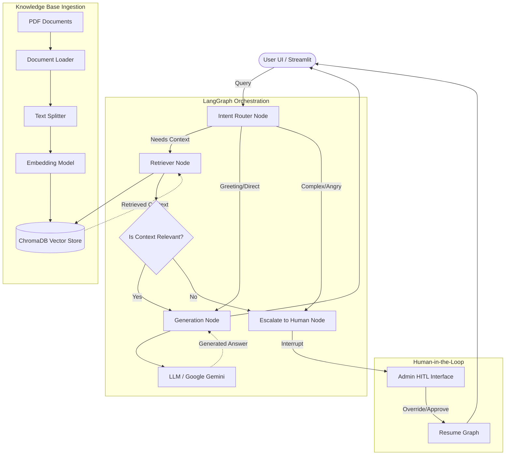

# High-Level Design (HLD)
## RAG-Based Customer Support Assistant

### 1. System Overview

**Problem Definition:**
Customer support teams often spend significant time answering repetitive queries. While traditional chatbots can handle basic FAQs, they fail at retrieving nuanced information from complex product manuals or policies and often lack a seamless escalation path when they cannot resolve an issue.

**Scope of the System:**
The proposed system is a Retrieval-Augmented Generation (RAG) based support assistant. It will:
- Ingest and index PDF knowledge bases (e.g., policies, manuals).
- Understand user intent to either answer directly or retrieve information.
- Provide accurate, context-grounded answers using an LLM.
- Route low-confidence or complex queries to a human agent using a Human-in-the-Loop (HITL) mechanism.
- Orchestrate the entire flow using LangGraph for robust state management.

---

### 2. Architecture Diagram

---

### 3. Component Description

- **Document Loader:** Uses `pypdf` to extract raw text from PDF files.
- **Chunking Strategy:** `RecursiveCharacterTextSplitter` breaks text into chunks of 1000 characters with an overlap of 200, ensuring paragraph continuity is maintained.
- **Embedding Model:** Google Generative AI embeddings (or HuggingFace `all-MiniLM-L6-v2`) translate text chunks into high-dimensional vectors representing semantic meaning.
- **Vector Store:** `ChromaDB` stores the embeddings and enables fast nearest-neighbor similarity searches.
- **Retriever:** Takes the embedded user query and queries ChromaDB for the top *K* (e.g., *k=4*) most relevant document chunks.
- **LLM:** A Large Language Model (e.g., Google Gemini) responsible for synthesizing the retrieved context into a natural, helpful response.
- **Graph Workflow Engine:** `LangGraph` defines the state machine, managing the flow of data (`messages`, `context`, `escalation_flag`) between the retrieval, generation, and escalation nodes.
- **Routing Layer:** A conditional logic edge in LangGraph that evaluates the initial user query and decides the next node.
- **HITL Module:** Utilizes LangGraph's `interrupt_before` functionality to pause execution and await human input before sending a final response to the user.

---

### 4. Data Flow

1. **Ingestion:** PDF -> Text -> Chunks -> Embeddings -> ChromaDB.
2. **Query Lifecycle:**
   - User submits a query via the UI.
   - The query is added to the LangGraph `State`.
   - **Router Edge** evaluates the query. If it's a standard support question, it routes to the `Retriever Node`.
   - **Retriever Node** fetches relevant chunks from ChromaDB and appends them to the `State`.
   - **Generation Node** reads the query and context from the `State`, prompts the LLM, and generates an answer.
   - If the intent was detected as "escalate" or the context was insufficient, it routes to the **Escalate Node**.
   - **Escalate Node** triggers an `interrupt`. The graph pauses. A human reviews the state, provides a manual answer, and resumes the graph.
   - The final answer is returned to the user.

---

### 5. Technology Choices

- **ChromaDB:** Chosen for its simplicity, fast local execution, and seamless integration with LangChain. It requires no external database setup for this project phase.
- **LangGraph:** Unlike standard linear chains, LangGraph allows for cycles, state management, and critical features like pausing for HITL. It treats the workflow as a state machine, which is ideal for complex support logic.
- **LLM Choice (Google Gemini):** Offers excellent reasoning capabilities, large context windows, and cost-effective API access, making it highly suitable for RAG tasks.
- **Streamlit:** Allows for rapid prototyping of a web-based user interface without needing deep frontend expertise.

---

### 6. Scalability Considerations

- **Handling Large Documents:** Moving from local ChromaDB to a managed vector database (e.g., Pinecone or Weaviate) as document volume grows. Implementing asynchronous document processing queues (e.g., Celery).
- **Increasing Query Load:** Deploying the LangGraph application behind a scalable FastAPI backend with load balancing.
- **Latency Concerns:** Implementing semantic caching (e.g., caching exact or highly similar queries) to bypass the LLM and vector search entirely for repeated questions. Using faster embedding models.
